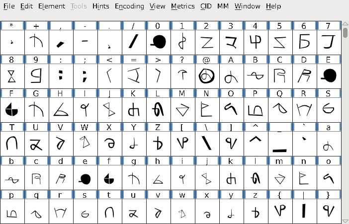
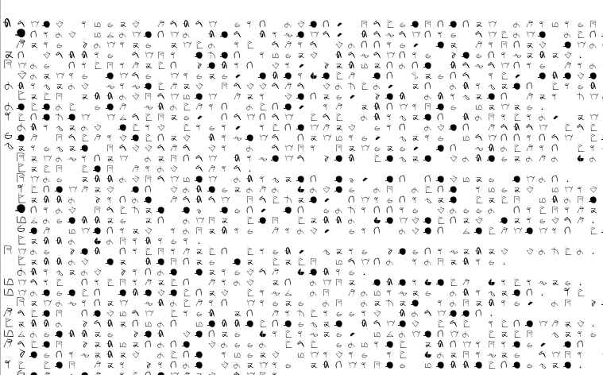
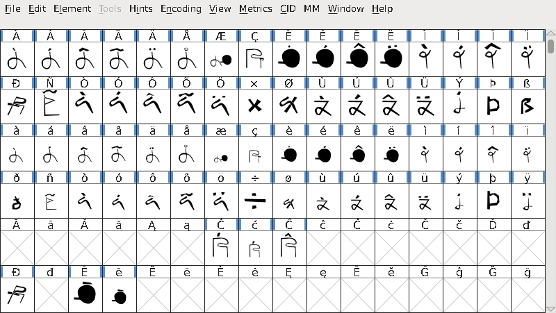
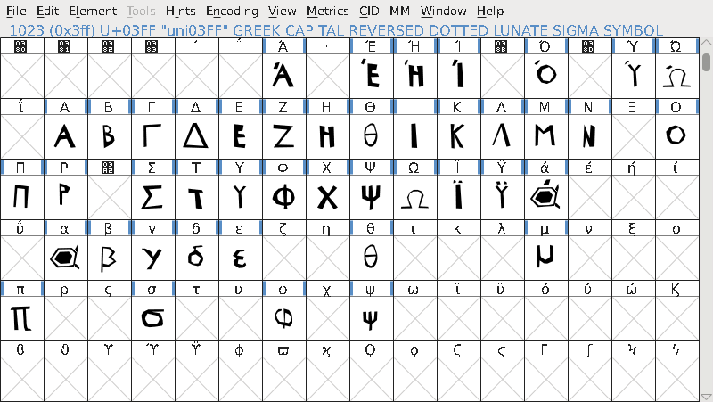
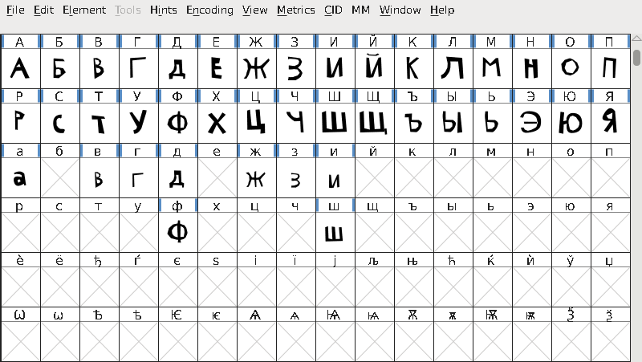

# Kokaiop

Hey.

So here's yet another small project of mine.
This time, it's something a bit larger than some icons.

A fully-featured, and working, font.

## About

Kokaiop \(pronounced ko-kye-op) is a font project of mine.  It's a glyph-based font, but it still supports basic English, most Greek, a hint of Cryllic \(all those Russian letters) and some miscellaneous symbols.  It also supports around 1/4-1/2 of Latin Extended-A in case you were wondering.

The font itself was created in FontForge, so kudos to them.

## Status

- [x] Supporting Basic English
- [x] Fully Supporting Latin-1 Supplement
- [ ] Fully Supporting Latin Extended-A
- [ ] Fully Supporting Greek
- [ ] Fully Supporting Cryllic

## Screenshots

Some basic writing.  Periods, commas, letters.  All the stuff you learn(ed) in 3rd grade.

Here's where thing get a bit more advanced.

A shot of Greek. (Around 1/2 done at the time of writing)

And finally, Cryllic.

